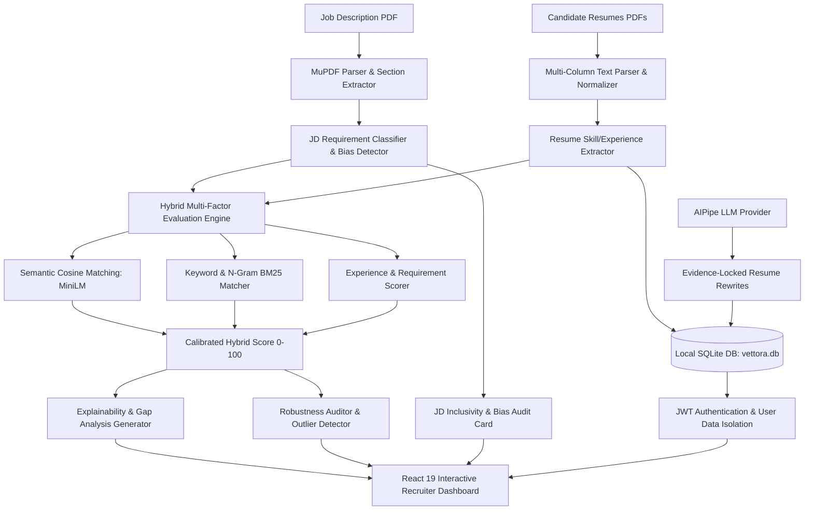

# 🌟 Vettora — AI Vetting & Vectorized Shortlisting Platform
### *AI-Powered Multimodal Resume-to-Job Matching, Inclusivity Auditing & Explainable Shortlisting Suite*

[](https://www.python.org/)
[](https://fastapi.tiangolo.com/)
[](https://react.dev/)
[](https://pytest.org/)
[](https://huggingface.co/sentence-transformers/all-MiniLM-L6-v2)
[](LICENSE)

---

## 📌 Executive Summary

**Vettora** is a production-grade, evidence-grounded career intelligence and candidate vetting platform. Built across 9 meticulous phases, Vettora transforms career coaching from speculative keyword manipulation into a verifiable, deterministic science. 

Candidates start with their actual resume, build an immutable **Evidence Vault** and **Career Twin**, evaluate realistic **Job Fit** against market requirements, bridge gaps through **Career Intelligence** and **Career Execution**, prepare with **Interview Readiness**, and publish an honest, shareable **Career Showcase** containing exclusively verified accomplishments with claim scope preservation (Levels 1–5).

### The Complete End-to-End Pipeline
```text
RESUME → EVIDENCE VAULT → CAREER TWIN → JOB FIT → RESUME COACH → RESUME BUILDER → CAREER INTELLIGENCE → INTERVIEW READINESS → CAREER EXECUTION → CAREER SHOWCASE
```

---

## 🚀 Key System Highlights



---

## 💡 Core Capabilities & Innovation

### 1. 📄 Robust Multimodal Document Parsing
- High-fidelity PDF extraction via **PyMuPDF** handling single/multi-column layouts, tabular resume blocks, and irregular headings.
- Deterministic section detection (Education, Experience, Skills, Projects, Certifications) with smart whitespace and Unicode normalization.

### 2. 🧠 Hybrid Multi-Factor Evaluation Engine
Vettora avoids simplistic keyword counts by computing a calibrated multi-dimensional match score:
$$\text{Score} = w_{\text{req}} S_{\text{req}} + w_{\text{pref}} S_{\text{pref}} + w_{\text{exp}} S_{\text{exp}} + w_{\text{sem}} S_{\text{sem}} + w_{\text{key}} S_{\text{key}} - \text{Penalties}$$
- **Required Requirements Weight**: 35%
- **Preferred Qualifications Weight**: 15%
- **Experience Duration & Depth Weight**: 20%
- **Semantic Vector Alignment (`all-MiniLM-L6-v2`)**: 20%
- **Direct Keyword & Technical Skill Overlap**: 10%

### 3. 🛡️ Job Description Inclusivity & Bias Detector
Vettora automatically audits job postings before candidate ranking to eliminate barriers to diverse talent:
- **5 Bias Classifications**:
  1. 🚻 **Gender-Coded / Hyper-Aggressive Terms**
  2. 🎓 **Pedigree & Tier-1 Degree Locks**
  3. ⏳ **Unrealistic Experience Ceilings**
  4. 🎂 **Age & Generational Markers**
  5. ♿ **Ableist & Non-Essential Physical Demands**
- **Scoring & Feedback**: 0–100 Inclusivity Score, highlighted contextual snippets, and direct **Inclusive Alternatives**.

### 4. 🤖 Evidence-Grounded AI (AIPipe)
- Integrates with the **AIPipeLLMProvider** (via OpenRouter) to provide strict, evidence-locked resume edits.
- The AI is structurally constrained from hallucinating facts, metrics, or technologies that are not explicitly present in the candidate's immutable **Evidence Vault**.
- Generates **plain-language hiring justifications** and highlights exact **Matched Strengths** and **Critical Missing Requirements**.

### 5. 🔐 Multi-Tenant Architecture & Data Persistence
- Full **JWT-based Authentication** system allowing multiple candidates/recruiters to securely access their isolated data.
- Leverages **SQLAlchemy** over a local **SQLite** database (`vettora.db`) for lightweight, high-performance data persistence (Career Twins, Resume Versions, Career Executions).

### 6. 🏆 Interactive Recruiter & Candidate Experience (React 19 + Vite)
- **Top-3 Podium Cards** for instant visual identification of best-fit candidates.
- **Dynamic Candidate Inspection Modal** with side-by-side match breakdown, radial score gauges, and evidence snippets.
- Real-time **Career Execution Dashboards** for tracking candidate upskilling and job application progress.

---

## 📂 Repository Structure

```
vettora/
├── backend/                       # FastAPI backend service
│   ├── app/
│   │   ├── api/routes/            # API endpoints (/auth, /coach, /analyze)
│   │   ├── core/                  # Configuration, Auth & CORS settings
│   │   ├── db/                    # SQLAlchemy models & SQLite setup
│   │   ├── schemas/               # Pydantic v2 schemas
│   │   └── services/              # Core algorithms & AI Logic
│   │       ├── coach/llm/         # AIPipe integration for resume rewriting
│   │       ├── document_parser/   # PDF parsing & text normalization
│   │       ├── semantic_matcher/  # MiniLM embedding similarity
│   │       └── career_execution/  # Execution timeline & progress trackers
│   ├── tests/                     # Comprehensive test suite covering 9 phases
│   └── requirements.txt           # Python dependencies
├── frontend/                      # React 19 + Vite dashboard
│   ├── src/
│   │   ├── views/                 # Auth, ResumeCoach, Dashboard, JobFit, CareerExecution
│   │   ├── App.jsx                # Main Application routing
│   │   └── App.css                # Premium modern UI design system (espresso/linen palette)
│   └── package.json               # Frontend dependencies & scripts
├── data/                          # DB Storage & Evaluation samples
│   ├── vettora.db                 # Local SQLite Database
│   └── testing_dataset/           # Sample JD & candidate resumes
└── docs/                          # Comprehensive technical documentation
```

---

## ⚡ Quickstart Guide

### Prerequisites
- **Python 3.11+**
- **Node.js 18+** & **npm**

---

### 1. Start Backend (FastAPI)

```bash
cd backend

# Create and activate virtual environment
python3 -m venv venv
source venv/bin/activate       # On Windows: venv\Scripts\activate

# Install dependencies
pip install -r requirements.txt

# Run FastAPI backend
uvicorn app.main:app --host 127.0.0.1 --port 8000 --reload
```
> Backend API Swagger Docs: `http://127.0.0.1:8000/docs`  

---

### 2. Start Frontend (React + Vite)

In a new terminal window:

```bash
cd frontend

# Install packages
npm install

# Start Vite dev server
npm run dev
```
> Open browser at `http://127.0.0.1:5173`

---

### 3. Run Automated Tests

To execute the comprehensive test suite spanning all 9 phases:

```bash
cd backend
source venv/bin/activate
pytest
```

---

## 📊 Evaluation & Usage

1. Launch the frontend dashboard at `http://localhost:5173`.
2. **Create an account** or sign in to access your isolated data vault.
3. Upload a Resume to automatically generate your **Career Twin** and **Evidence Vault**.
4. Define a **Job Target** to see a side-by-side **Job Fit** analysis (identifying gaps and matched skills).
5. Use the **Resume Builder** and **Resume Coach** to safely rewrite bullet points using the AIPipe engine.
6. Track your upskilling via **Career Execution**.

---

## 👥 Team Brocode
- **Team**: Brocode
- **Project**: Vettora — AI Vetting & Vectorized Shortlisting Platform
